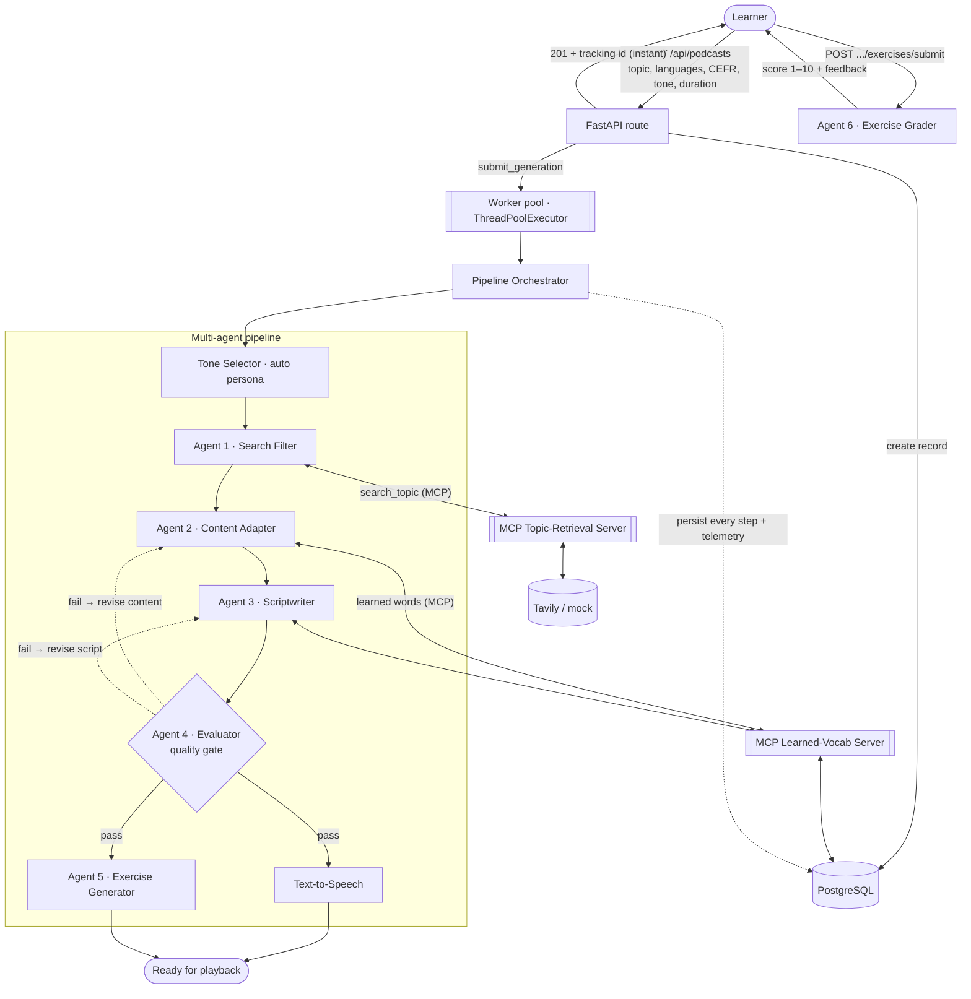
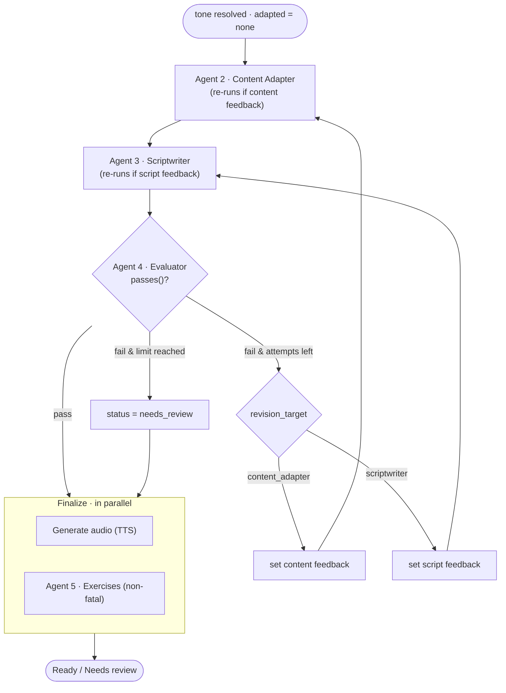

# Beshno — Multi-Agent Architecture

Beshno turns a topic and a language pair into a level-appropriate, two-phase
audio podcast with an interactive practice session. It does this with a
**pipeline of specialised LLM agents**, a self-correcting **quality gate**, and
two **Model Context Protocol (MCP)** servers — one for agentic web retrieval and
one for spaced-repetition vocabulary memory.

This document describes that design: what each agent does, how the orchestrator
wires them together, how the evaluator loop self-corrects, how generation runs
off the request thread, and how the whole thing degrades gracefully to mock
providers with zero API keys.

> For the product overview, stack table and repo layout, see the
> [root README](../README.md). This document focuses on the agents.

---

## 1. The big picture

A single HTTP request (`POST /api/podcasts`) creates a DB record and **returns
immediately** with `201 Created` and a tracking id — it does not wait for the
agents. The generation job is handed to a dedicated **worker pool**
([`pipeline/runner.py`](../backend/app/pipeline/runner.py)), so the request
thread is never blocked. Each agent persists its artefact as it goes, so the
frontend can poll stage-level progress while the run proceeds in the background.
The Evaluator can send work back to earlier agents before audio is ever
generated, and the final audio + exercises steps run **concurrently**.



**Non-blocking execution.** `submit_generation(id)` dispatches the job to a
bounded `ThreadPoolExecutor` (`PIPELINE_WORKERS`, default 4) and returns. Setting
`PIPELINE_WORKERS=0` runs generation inline/synchronously — the mode the test
suite uses for deterministic assertions. The pool is drained on app shutdown.

**Tone Selector** runs first (only when `tone=auto`) to pick a narrator persona
from the topic; the resolved tone then steers Agents 2 and 3. **Agent 6
(Exercise Grader)** is the one truly on-demand agent — it runs only when the
learner submits answers, via a separate HTTP request.

---

## 2. The agents

All agents share a tiny [`Agent`](../backend/app/agents/base.py) base (it holds
the LLM provider and a helper to query learned vocabulary) and return
**Pydantic-validated structured output** — the LLM is constrained to a schema, so
every hand-off downstream is typed data, not free text. Schemas live in
[`content_models.py`](../backend/app/content_models.py).

| # | Agent | Module | Input | Output schema | Role |
|---|-------|--------|-------|---------------|------|
| 1 | **Search Filter** | [`search_filter.py`](../backend/app/agents/search_filter.py) | topic, languages, CEFR | `SearchFilterResult` | Agentically researches the topic via the MCP `search_topic` tool, then selects the 5 best sources |
| 2 | **Content Adapter** | [`content_adapter.py`](../backend/app/agents/content_adapter.py) | sources, tone, duration, (optional) feedback | `AdaptedContent` | Rewrites the sources into one faithful, CEFR-calibrated text in the target language, with key points + vocab |
| 3 | **Scriptwriter** | [`scriptwriter.py`](../backend/app/agents/scriptwriter.py) | adapted content, tone, duration, (optional) feedback | `PodcastScript` | Builds the two-phase episode: full target-language playback, then a chunk-by-chunk breakdown |
| 4 | **Evaluator** | [`evaluator.py`](../backend/app/agents/evaluator.py) | script + adapted content | `EvaluationResult` | Quality gate: scores 4 dimensions 0–5, decides pass/fail, routes failures back to Agent 2 or 3 |
| 5 | **Exercise Generator** | [`exercise_generator.py`](../backend/app/agents/exercise_generator.py) | adapted content | `ExerciseSet` | Creates 5 exercises: 1 speaking, 2 vocabulary, 2 reading MCQ |
| 6 | **Exercise Grader** | [`exercise_grader.py`](../backend/app/agents/exercise_grader.py) | exercise set + learner answers | `ExerciseGrade` | Grades the submission like a supportive teacher: 1–10 score + per-item feedback |
| — | **Tone Selector** *(aux)* | [`tone_selector.py`](../backend/app/agents/tone_selector.py) | topic, languages | `ToneSelection` | When `tone=auto`, picks the narrator persona that best fits the topic |

### Why split into agents?

Each agent has **one job, one prompt, one output schema**. This keeps each
prompt focused, makes failures localised (the Evaluator can name *which* agent
to re-run), and lets the orchestrator log, time, token-meter and replay each
step independently.

---

## 3. MCP: agentic retrieval and vocabulary memory

Two standalone **MCP servers** run as stdio subprocesses, each fronted by a
synchronous client facade that bridges the async MCP SDK to the synchronous
pipeline thread.

### 3.1 Topic retrieval — Agent 1's research tool

Agent 1 does **not** receive a pre-fetched batch of search results. Instead it is
given a tool — `search_topic` — and decides for itself how to research the topic,
possibly issuing several refined queries before selecting sources.

The tool is exposed by [`topic_server.py`](../backend/app/mcp/topic_server.py),
which wraps whatever `SearchProvider` is configured (Tavily or the mock). The
client facade ([`client.py`](../backend/app/mcp/client.py)) **caches every
retrieved page by URL**, so the orchestrator can build Agent 2's source material
from exactly what Agent 1 saw — no separate fetch — and **caps** the gathered
sources at `search_max_results` (default 10).


A **safety net** guarantees robustness: if the model ever answers without calling
the tool, the orchestrator performs one canned search itself so there is always
source material. The mock LLM uses this same `mock_bootstrap` path, which is why
the whole pipeline runs offline. The two stages the UI shows — *Researching* and
*Selecting sources* — both come out of this single agentic loop.

### 3.2 Learned-vocabulary memory — spaced repetition

A second MCP server ([`vocab_server.py`](../backend/app/mcp/vocab_server.py),
fronted by [`vocab_client.py`](../backend/app/mcp/vocab_client.py)) gives the
pipeline **persistent memory** of what a learner has already been taught. Before
writing, Agents 2 and 3 query it for words this user has already learned in this
target language and avoid re-introducing them. After a successful run, the
orchestrator records the episode's new key vocabulary back to the
`user_learned_vocabulary` table — so each episode builds on, rather than repeats,
the last. Vocabulary avoidance is best-effort: if the MCP session is unavailable
the pipeline proceeds normally.

---

## 4. The orchestrator and the self-correcting quality loop

[`orchestrator.py`](../backend/app/pipeline/orchestrator.py) drives the whole
run: it resolves the tone, opens the vocab MCP session, then runs the agents. The
interesting part is the **bounded revision loop** between Agents 2, 3 and 4: the
Evaluator reviews the script *before* any audio is generated, and on failure
routes its feedback to the agent best placed to fix the problem.



**How the gate decides.** The Evaluator scores four dimensions 0–5:

1. `cefr_compliance` — is the target text at the right level?
2. `pedagogical_quality` — are the breakdowns accurate and well-tied to chunks
   (and, in immersion mode, free of any native language)?
3. `factual_accuracy` — faithful to the adapted source, no hallucinations?
4. `engagement_flow` — natural, well-paced segmentation that reads coherently
   end-to-end?

A script passes only when the model's own `passed` verdict **and** the score
thresholds agree ([`EvaluatorAgent.passes`](../backend/app/agents/evaluator.py)):
every dimension ≥ 3.0 **and** overall ≥ 3.8. This double check stops an
over-generous verdict from slipping through.

**Feedback routing.** A failed verdict carries a `revision_target`:
`"content_adapter"` when the underlying content is wrong (facts, source level) or
`"scriptwriter"` when the segmentation/breakdowns are the problem. The
orchestrator sets the matching feedback string, and the next loop iteration
re-runs *only* that agent (re-running Agent 2 also forces a fresh Agent 3, since
the content changed). The loop is bounded by `max_revisions` (default 2); on
exhaustion the podcast is still delivered but flagged `needs_review`.

**Parallel finalize.** Once the script passes, TTS synthesis and exercise
generation are independent (audio needs the script; Agent 5 only needs the
adapted content). The orchestrator runs them **concurrently** on a small thread
pool and persists both results once they complete — audio is the long pole, so
the quiz is generated essentially for free in its shadow. Audio is required (a
failure fails the podcast); exercises are a bonus (a failure is logged but the
podcast still ships).

---

## 5. Two output strategies: dual-language vs immersion

The Scriptwriter and Evaluator change behaviour based on CEFR level
([`is_immersion_level`](../backend/app/enums.py)):

| Levels | Mode | Episode language |
|--------|------|------------------|
| A1 / A2 / B1 | **Dual-language** | Target-language content, **native-language** breakdown after each chunk |
| B2 / C1 / C2 | **Full immersion** | 100% target language — intro, cues, content and the deeper explanations |

Every episode is **two-phase** audio, assembled by `_script_to_segments`:

1. **Phase 1 — full playback:** every chunk's target text, read near-seamlessly.
2. **Phase 2 — breakdown:** each chunk again, followed by its explanation.

The synthesis step also emits **timed transcript cues** aligned to the audio, so
the frontend can highlight and scroll the transcript in sync with playback
(karaoke-style) and seek by clicking text.

Voices are split by role: a **female** voice for the learner/content, a **male**
voice for the teacher/explainer. Crucially, a target-language word quoted inside
a native breakdown is emitted as its own `ExplanationRun` with `lang="target"`,
so the TTS layer pronounces it with the *target* voice instead of mangling it
with native phonetics. See the
[TTS voice-selection notes](../backend/app/providers/tts/google.py) for how the
best available voice tier (Chirp 3: HD → Neural2 → WaveNet → Standard) is chosen
per language.

---

## 6. Provider abstraction & graceful degradation

Every external dependency sits behind a small protocol with a **mock**
implementation, resolved by [`providers/__init__.py`](../backend/app/providers/__init__.py):

| Capability | Real provider | Mock behaviour |
|------------|---------------|----------------|
| LLM | Claude (`structured` + `structured_with_tools`) | Returns the agent's `mock_example` / runs `mock_bootstrap`; reports estimated token usage |
| Search | Tavily | Canned, deterministic sources |
| TTS | Google Cloud TTS | Silent WAV of the right duration |

If a key or dependency is missing, the factory logs a **loud warning** and falls
back to the mock — so the service always starts and the full pipeline always runs
end-to-end. This is also what makes the test suite fast and hermetic
(`tests/conftest.py` forces all three mocks + SQLite + inline generation).

The two LLM entry points matter for the agent design:

- `structured(...)` — a single schema-constrained completion (Agents 2–6, Tone
  Selector). It **streams** the response so a generous `max_tokens` (room for
  thinking *and* the JSON) is safe.
- `structured_with_tools(...)` — an agentic tool-use loop bounded by
  `agent_max_steps`, used by Agent 1 to drive MCP retrieval.

**Extended thinking is model-aware.** `ANTHROPIC_THINKING` selects the mode —
`adaptive` (Opus 4.7+/Fable), `off` (models without it, e.g. Haiku 4.5), or
`enabled[:budget]` (a fixed budget, sized so it never exceeds the call's
`max_tokens`). If the configured model rejects the thinking parameter, the
provider logs a warning, disables thinking for the rest of the run, and retries —
so generation works on any model without configuration.

---

## 7. Observability & telemetry: every step is persisted

As the pipeline advances, the orchestrator writes to the database so the run is
fully replayable and the frontend can poll progress:

- **`stage_history`** on the podcast — an append-only log of
  `started` / `completed` / `failed` events per stage, with labels and
  timestamps.
- **`AgentStep`** rows — one per agent invocation (and the audio step): the agent
  name, stage, revision iteration, inputs, full output, duration in ms, and the
  **input/output token usage** attributed to that step. Exposed at
  `GET /api/podcasts/{id}/steps` for step-by-step review.
- **`Evaluation`** rows — every Evaluator verdict (scores, pass/fail, feedback,
  revision target) across all revision iterations.

**Generation telemetry.** A per-run [`TelemetryRecorder`](../backend/app/telemetry.py)
is attached to the run's LLM instance (a fresh instance per run, so concurrent
generations never share counters; thread-safe so the parallel exercise step
records safely). At completion the podcast stores total input/output tokens, the
number of LLM calls, and total wall-clock generation time. The detail API also
exposes a **cost estimate** computed from those tokens at the configured model's
published list price (snapshot suffixes like `-20251001` are normalised to a
pricing key), surfaced in the UI's "Generation analytics" panel.

The ordered stages surfaced in the UI are:

```
Researching → Selecting sources → Adapting → Writing script
           → Reviewing quality → Generating audio · Creating exercises → Ready
```

(The last two run in parallel.)

---

## 8. End-to-end sequence

```mermaid
sequenceDiagram
    autonumber
    participant FE as Frontend
    participant API as FastAPI
    participant POOL as Worker pool
    participant ORCH as Orchestrator
    participant AG as Agents + Tone
    participant TTS
    participant DB as PostgreSQL

    FE->>API: POST /api/podcasts
    API->>DB: create record (pending)
    API->>POOL: submit_generation(id)
    API-->>FE: 201 + tracking id (instant)
    FE->>API: poll GET /status … (until terminal)
    POOL->>ORCH: run on worker thread

    ORCH->>AG: resolve tone (if auto)
    ORCH->>AG: Agent 1 research + filter (topic MCP)
    AG-->>ORCH: top 5 sources + materials
    loop until pass or max_revisions
        ORCH->>AG: Agent 2 adapt (vocab MCP, feedback?)
        ORCH->>AG: Agent 3 script (vocab MCP, feedback?)
        ORCH->>AG: Agent 4 evaluate
        AG-->>ORCH: scores + verdict + revision_target
    end
    par audio ∥ exercises
        ORCH->>TTS: synthesize two-phase audio
        TTS-->>ORCH: WAV + timed transcript
    and
        ORCH->>AG: Agent 5 generate exercises (non-fatal)
        AG-->>ORCH: ExerciseSet
    end
    ORCH->>DB: record learned vocab; status + telemetry (tokens, time, cost)

    Note over FE,API: Later — practice session
    FE->>API: POST /exercises/submit (answers)
    API->>AG: Agent 6 grade
    API-->>FE: score 1–10 + teacher feedback
```

---

## 9. Where to look in the code

| Concern | File |
|---------|------|
| Non-blocking dispatch (worker pool) | [`pipeline/runner.py`](../backend/app/pipeline/runner.py) |
| Orchestration, revision loop, parallel finalize, audio assembly | [`pipeline/orchestrator.py`](../backend/app/pipeline/orchestrator.py) |
| Agents (one file each) | [`agents/`](../backend/app/agents/) |
| Agent output schemas | [`content_models.py`](../backend/app/content_models.py) |
| Topic MCP (research) | [`mcp/topic_server.py`](../backend/app/mcp/topic_server.py), [`mcp/client.py`](../backend/app/mcp/client.py) |
| Vocab MCP (spaced repetition) | [`mcp/vocab_server.py`](../backend/app/mcp/vocab_server.py), [`mcp/vocab_client.py`](../backend/app/mcp/vocab_client.py) |
| Provider factories + mocks + thinking config | [`providers/`](../backend/app/providers/), [`config.py`](../backend/app/config.py) |
| Token/latency/cost telemetry | [`telemetry.py`](../backend/app/telemetry.py) |
| Stages, statuses, tones, durations, immersion rule | [`enums.py`](../backend/app/enums.py) |
| HTTP routes (incl. exercise submit) | [`api/routes_podcasts.py`](../backend/app/api/routes_podcasts.py) |
