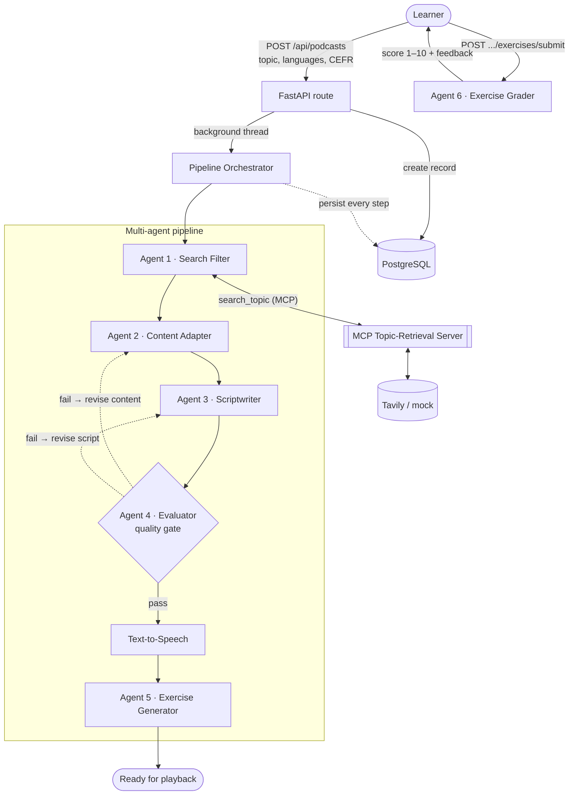
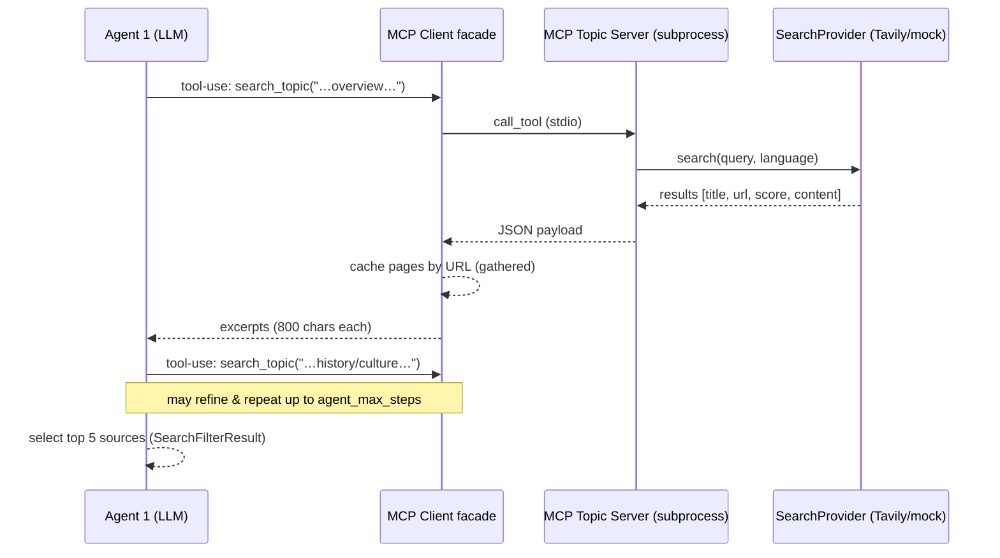
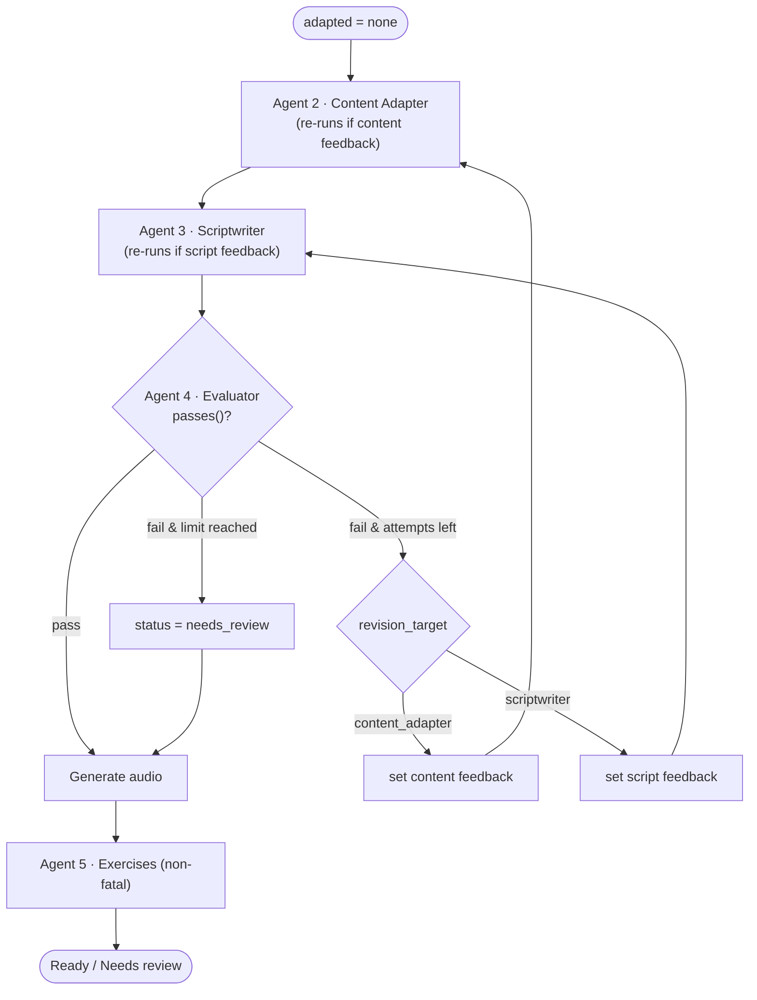
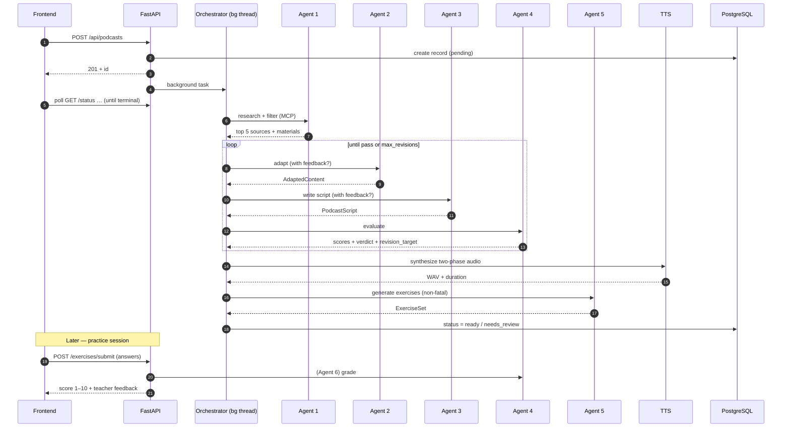

# Beshno — Multi-Agent Architecture

Beshno turns a topic and a language pair into a level-appropriate, two-phase
audio podcast with an interactive practice session. It does this with a
**pipeline of six specialised LLM agents**, a self-correcting **quality gate**,
and an **agentic web-retrieval step** powered by the Model Context Protocol
(MCP).

This document describes that multi-agent design: what each agent does, how the
orchestrator wires them together, how the evaluator loop self-corrects, and how
the whole thing degrades gracefully to mock providers with zero API keys.

> For the product overview, stack table and repo layout, see the
> [root README](../README.md). This document focuses on the agents.

---

## 1. The big picture

A single HTTP request (`POST /api/podcasts`) creates a DB record and kicks off
the pipeline in a **background thread**. The agents run in sequence, each
persisting its artefact so the frontend can poll stage-level progress. The
Evaluator can send work back to earlier agents before audio is ever generated.



Two of the six agents run **after** generation, on demand:

- **Agent 5 (Exercise Generator)** runs at the end of the pipeline.
- **Agent 6 (Exercise Grader)** runs only when the learner submits answers — it
  is triggered by a separate HTTP request, not the generation pipeline.

---

## 2. The six agents

All agents share a tiny [`Agent`](../backend/app/agents/base.py) base (just holds
the LLM provider) and return **Pydantic-validated structured output** — the LLM
is constrained to a schema, so every hand-off downstream is typed data, not free
text. Schemas live in [`content_models.py`](../backend/app/content_models.py).

| # | Agent | Module | Input | Output schema | Role |
|---|-------|--------|-------|---------------|------|
| 1 | **Search Filter** | [`search_filter.py`](../backend/app/agents/search_filter.py) | topic, languages, CEFR | `SearchFilterResult` | Agentically researches the topic via the MCP `search_topic` tool, then selects the 5 best sources |
| 2 | **Content Adapter** | [`content_adapter.py`](../backend/app/agents/content_adapter.py) | sources + (optional) feedback | `AdaptedContent` | Rewrites the sources into one faithful, CEFR-calibrated text (~3–5 pages) in the target language, with key points + vocab |
| 3 | **Scriptwriter** | [`scriptwriter.py`](../backend/app/agents/scriptwriter.py) | adapted content + (optional) feedback | `PodcastScript` | Builds the two-phase episode: full target-language playback, then a chunk-by-chunk breakdown |
| 4 | **Evaluator** | [`evaluator.py`](../backend/app/agents/evaluator.py) | script + adapted content | `EvaluationResult` | Quality gate: scores 5 dimensions 0–5, decides pass/fail, routes failures back to Agent 2 or 3 |
| 5 | **Exercise Generator** | [`exercise_generator.py`](../backend/app/agents/exercise_generator.py) | adapted content | `ExerciseSet` | Creates 5 exercises: 1 speaking, 2 vocabulary, 2 reading MCQ |
| 6 | **Exercise Grader** | [`exercise_grader.py`](../backend/app/agents/exercise_grader.py) | exercise set + learner answers | `ExerciseGrade` | Grades the submission like a supportive teacher: 1–10 score + per-item feedback |

### Why split into agents?

Each agent has **one job, one prompt, one output schema**. This keeps each
prompt focused, makes failures localised (the Evaluator can name *which* agent
to re-run), and lets the orchestrator log, time and replay each step
independently.

---

## 3. Agent 1 — agentic retrieval over MCP

Agent 1 does **not** receive a pre-fetched batch of search results. Instead it
is given a tool — `search_topic` — and decides for itself how to research the
topic, possibly issuing several refined queries before selecting sources.

The tool is exposed by a standalone **MCP server**
([`topic_server.py`](../backend/app/mcp/topic_server.py)) that runs as a
subprocess over stdio and wraps whatever `SearchProvider` is configured (Tavily
or the mock). A synchronous facade
([`client.py`](../backend/app/mcp/client.py)) bridges the async MCP SDK to the
synchronous pipeline thread and **caches every retrieved page by URL**, so the
orchestrator can build Agent 2's source material from exactly what Agent 1 saw —
no separate fetch.



A **safety net** guarantees robustness: if the model ever answers without
calling the tool, the orchestrator performs one canned search itself so there is
always source material. The mock LLM uses this same `mock_bootstrap` path, which
is why the whole pipeline runs offline.

The two distinct stages the UI shows — *Researching* and *Selecting sources* —
both come out of this single agentic loop.

---

## 4. The orchestrator and the self-correcting quality loop

[`orchestrator.py`](../backend/app/pipeline/orchestrator.py) drives the whole
run. The interesting part is the **bounded revision loop** between Agents 2, 3
and 4: the Evaluator reviews the script *before* any audio is generated, and on
failure routes its feedback to the agent best placed to fix the problem.



**How the gate decides.** The Evaluator scores five dimensions 0–5:

1. `cefr_compliance` — is the target text at the right level?
2. `language_balance` — is the target/native split pedagogically useful?
3. `pedagogical_quality` — are the breakdowns accurate and well-tied to chunks?
4. `factual_accuracy` — faithful to the adapted source, no hallucinations?
5. `engagement_flow` — natural segmentation, coherent when read end-to-end?

A script passes only when the model's own `passed` verdict **and** the score
thresholds agree ([`EvaluatorAgent.passes`](../backend/app/agents/evaluator.py)):
every dimension ≥ 3.0 **and** overall ≥ 3.8. This double check stops an
over-generous verdict from slipping through.

**Feedback routing.** A failed verdict carries a `revision_target`:
`"content_adapter"` when the underlying content is wrong (facts, source level)
or `"scriptwriter"` when the segmentation/breakdowns are the problem. The
orchestrator sets the matching feedback string, and the next loop iteration
re-runs *only* that agent (re-running Agent 2 also forces a fresh Agent 3, since
the content changed). The loop is bounded by `max_revisions` (default 2); on
exhaustion the podcast is still delivered but flagged `needs_review`.

---

## 5. Two output strategies: dual-language vs immersion

The Scriptwriter and Evaluator change behaviour based on CEFR level
([`is_immersion_level`](../backend/app/enums.py)):

| Levels | Mode | Episode language |
|--------|------|------------------|
| A1 / A2 / B1 | **Dual-language** | Target-language content, **native-language** breakdown after each chunk |
| B2 / C1 / C2 | **Full immersion** | 100% target language — intro, cues, content and the deeper explanations |

Every episode is **two-phase** audio, assembled by `_script_to_segments`:

1. **Phase 1 — full playback:** every chunk's target text, read near-seamlessly.
2. **Phase 2 — breakdown:** each chunk again, followed by its explanation.

Voices are split by role: a **female** voice for the learner/content, a **male**
voice for the teacher/explainer. Crucially, a target-language word quoted inside
a native breakdown is emitted as its own `ExplanationRun` with `lang="target"`,
so the TTS layer pronounces it with the *target* voice instead of mangling it
with native phonetics. See the
[TTS voice-selection notes](../backend/app/providers/tts/google.py) for how the
best available voice tier (Chirp 3: HD → Neural2 → WaveNet → Standard) is chosen
per language.

---

## 6. Provider abstraction & graceful degradation

Every external dependency sits behind a small protocol with a **mock**
implementation, resolved by [`providers/__init__.py`](../backend/app/providers/__init__.py):

| Capability | Real provider | Mock behaviour |
|------------|---------------|----------------|
| LLM | Claude (`structured` + `structured_with_tools`) | Returns the agent's `mock_example` / runs `mock_bootstrap` |
| Search | Tavily | Canned, deterministic sources |
| TTS | Google Cloud TTS | Silent WAV of the right duration |

If a key or dependency is missing, the factory logs a **loud warning** and falls
back to the mock — so the service always starts and the full pipeline always
runs end-to-end. This is also what makes the test suite fast and hermetic
(`tests/conftest.py` forces all three mocks + SQLite).

The two LLM entry points matter for the agent design:

- `structured(...)` — a single schema-constrained completion (Agents 2–6).
- `structured_with_tools(...)` — an agentic tool-use loop bounded by
  `agent_max_steps`, used by Agent 1 to drive MCP retrieval.

---

## 7. Observability: every step is persisted

As the pipeline advances, the orchestrator writes to the database so the run is
fully replayable and the frontend can poll progress:

- **`stage_history`** on the podcast — an append-only log of
  `started` / `completed` / `failed` events per stage, with labels and
  timestamps.
- **`AgentStep`** rows — one per agent invocation (and the audio step): the
  agent name, stage, revision iteration, inputs, full output, and duration in
  ms. Exposed at `GET /api/podcasts/{id}/steps` for step-by-step review.
- **`Evaluation`** rows — every Evaluator verdict (scores, pass/fail, feedback,
  revision target) across all revision iterations.

The ordered stages surfaced in the UI are:

```
Researching → Selecting sources → Adapting → Writing script
           → Reviewing quality → Generating audio → Creating exercises → Ready
```

---

## 8. End-to-end sequence



*(Step 6 grading is Agent 6, the Exercise Grader — drawn on the A4 lane for
space.)*

---

## 9. Where to look in the code

| Concern | File |
|---------|------|
| Orchestration, revision loop, audio assembly | [`pipeline/orchestrator.py`](../backend/app/pipeline/orchestrator.py) |
| Agents (one file each) | [`agents/`](../backend/app/agents/) |
| Agent output schemas | [`content_models.py`](../backend/app/content_models.py) |
| MCP server / client | [`mcp/topic_server.py`](../backend/app/mcp/topic_server.py), [`mcp/client.py`](../backend/app/mcp/client.py) |
| Provider factories + mocks | [`providers/`](../backend/app/providers/) |
| Stages, statuses, immersion rule | [`enums.py`](../backend/app/enums.py) |
| HTTP routes (incl. exercise submit) | [`api/routes_podcasts.py`](../backend/app/api/routes_podcasts.py) |
